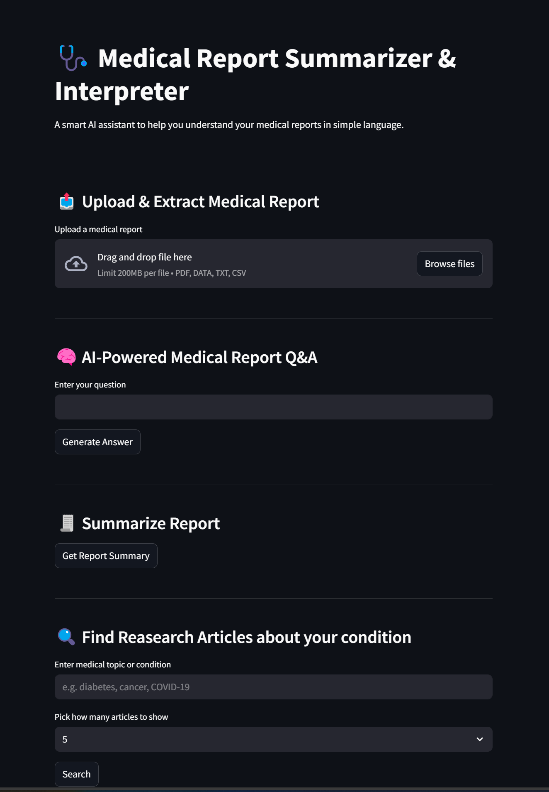

# 🩺 MediMind: AI-Powered Medical Report Summarizer

A Streamlit-based AI tool that extracts, summarizes, and interprets medical reports using LangChain and Gemini (Google Generative AI). Built for doctors, analysts, and patients to understand medical records effortlessly.

---

## 🚀 Features

- 📄 **Upload Medical Reports** (`.pdf`, `.csv`, `.txt`, `.data`)
- 🔍 **Intelligent Text Extraction** using fitz & Pandas
- 🧠 **LLM-Powered Summarization** using LangChain + Gemini
- ❓ **Interactive Q&A** based on the uploaded report
- 🌐 **Multilingual summaries** (English, Hindi, Telugu, Spanish, etc.)
- 🔍 **Search PubMed** for recent research articles on selected conditions
- ⬇️ Export summaries in multiple languages (text)  
- 💬 **Google Gemini + LangChain Integration** for contextual responses
- 🧾 Error-handling, session-state memory, and cloud-deployment-ready  
---

## 💡 Real-World Use Case

Doctors, freshers, or patients often struggle to interpret lengthy, jargon-heavy reports. MediMind:

- Converts raw reports into simple summaries  
- Answers user-specific questions based only on uploaded documents  
- Enhances understanding with recent research articles  
- Saves consultation time and reduces errors in critical evaluations 

---

## 🛠️ Tech Stack

| Tech                | Purpose                                       |
|---------------------|-----------------------------------------------|
| `Streamlit`         | Interactive front-end for the AI assistant    |   
| `LangChain`         | Prompt templates and LLM chaining             |
| `Gemini API`        | Generative summarization and Q&A              |
| `fitz`              | Extract text from PDF medical reports         |
| `pandas`            | Handle CSV and data file parsing              |
| `Deep Translator`   | Translate summaries into multiple languages   |
| `Entrez (NCBI)`     | Search and fetch articles from PubMed         |
| `.env + st.secrets` | Secure local/cloud API key management         |

---

## 🌍 Deployment Options

This app is compatible with:

- ✅ Local development  
- ✅ Streamlit Cloud  
- ✅ AWS EC2 / GCP VM / Docker-ready environments

---

## 📸 UI Preview (Home Page)

### Home Page

---

## 🧑‍💻 Run the App Locally

### 1. **Clone the repository**

`bash`
```
git clone https://github.com/Gayatridevi39/MediMind.git
cd MediMind
```
### 2. **Install Requirements**

`bash`
```
# Create virtual environment (replace 'venv' with your desired name)
python -m venv venv

# Activate the virtual environment

# For Windows:
venv\Scripts\activate

# For macOS/Linux:
source venv/bin/activate

# Then install dependencies
pip install -r requirements.txt
```
### 3. **Add Your Gemini API Key**

Create a `.env` file in the root directory:

`bash`
```
GEMINI_KEY="your_gemini_api_key_here" 
```
### 4. **Run the App**

`bash`
```
streamlit run app/main.py
```

## 🔐 Environment Variables

| Variable     | Description                       |
| ------------ | --------------------------------- |
| `GEMINI_KEY` | Your Google Generative AI API Key |


## 👥 Team

- Gayatri Devi Kajuluri - Team Lead, LLM Integration, Q&A, Frontend

- Shiva Teja Medoju - Session State

- Mattaparthi Tejaswini – Multilingual Summary Translation


---

## 🌱 Future Enhancements

- 🧬 Visual analytics for lab values & health indicators
- 🗣️ Voice-based query support for visually impaired users
- 🧠 Named Entity Recognition for diseases, drugs, symptoms
- 🏥 Real-time EHR/EMR integration for hospitals
- 🧾 PDF report summary export with branding

---

## 📬 Contact

If you have any questions or suggestions, feel free to reach out at 📧 [kajulurigayatridevi@gmail.com](mailto:kajulurigayatridevi@gmail.com)
🔗 [LinkedIn](https://www.linkedin.com/in/gayatri-devi-kajuluri/)

## 📢 Disclaimer

This app is for educational and research purposes only and is not intended for clinical diagnosis or treatment decisions. Please consult certified medical professionals for medical advice.

