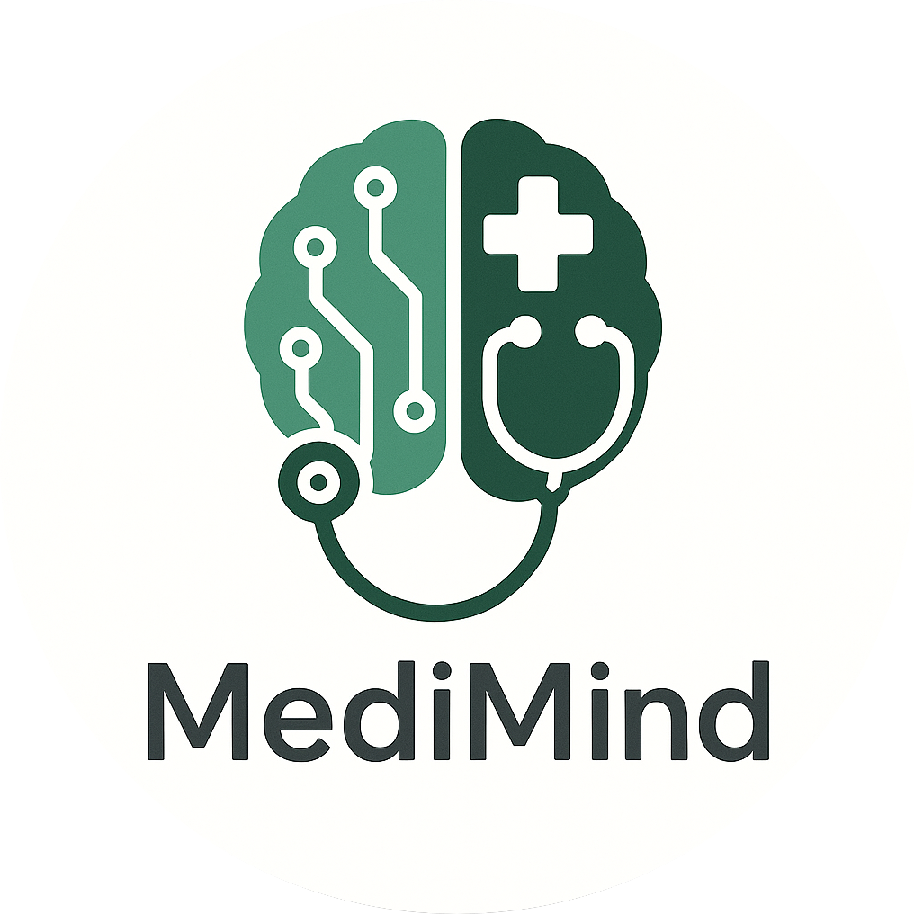

# 🩺 Medical Report Summarizer & Interpreter

> **AI-powered medical assistant** that simplifies complex medical reports, answers health-related questions, and finds relevant research — all with performance-optimized architecture and multilingual support.



---

## 🚀 Overview

**Medical Report Summarizer & Interpreter** is an advanced AI assistant built using **Streamlit**, **LangChain**, and **Gemini AI**, designed to:

- Extract text from various medical report formats.
- Summarize reports in human-friendly, concise language.
- Translate summaries into multiple languages.
- Answer user questions based on uploaded reports.
- Search for relevant PubMed research articles.
- Monitor app performance in real-time.

This project showcases scalable AI integration, optimized resource management, and accessible healthcare communication.

---

## 🧠 Key Features

### ✅ Report Upload & Text Extraction
- Uploads files in PDF, TXT, CSV, or custom DATA formats.
- Uses a performance-optimized `CacheOptimizer` for extraction.
- Garbage collection for large files to reduce memory overhead.

### 📝 Smart Summarization
- AI generates 4-line medical report summaries using **Gemini 2.0 Flash** via LangChain.
- Summaries are tailored for non-medical users and professionals alike.
- Supports **auto-translation** to 7+ languages (e.g., Hindi, Telugu, French, German).

### ❓ Medical Q&A Assistant
- Users can ask questions directly about their report.
- Answers are context-aware, AI-generated, and backed by the extracted content.
- Conversational tone with high accuracy, built for both laypeople and experts.

### 🔍 PubMed Research Search
- Users can search for related academic papers by condition/topic.
- Fetches and parses XML abstracts from PubMed APIs.
- Displays top articles with titles, abstracts, and links for in-depth reading.

### ⚡ Performance Monitoring
- Real-time performance tracking using custom decorators.
- Measures execution time for text extraction, summarization, Q&A, and search.
- Optional memory optimization through periodic cache clearing.

### 🌐 Multilingual Support
- Choose from English, Hindi, Telugu, Spanish, French, German, or Chinese.
- Uses Deep Translator with Google API for real-time translation.

### ⭐ User Feedback
- Built-in star rating system to gather user feedback.
- Sentiment-based UI prompts to improve user experience.

---

## 🧩 Tech Stack

| Layer            | Tools Used                                                                 |
|------------------|-----------------------------------------------------------------------------|
| Frontend         | [Streamlit](https://streamlit.io)                                           |
| AI/LLM           | [LangChain](https://www.langchain.com/), Gemini (via `langchain_google_genai`) |
| Translation      | [Deep Translator](https://pypi.org/project/deep-translator/)                |
| Research API     | [PubMed eUtils](https://www.ncbi.nlm.nih.gov/books/NBK25501/)               |
| Performance      | Custom decorators, `gc`, `@st.cache_*` methods                             |
| Environment Mgmt | `.env`, [python-dotenv](https://pypi.org/project/python-dotenv/)           |

---

## ⚙️ How to Run Locally

### 1. Clone the Repository
```bash
git clone https://github.com/yourusername/MediMind.git
cd Medimind
```

### 2. Set Up Environment
```bash
python -m venv venv
source venv/bin/activate  # On Windows use `venv\Scripts\activate`
pip install -r requirements.txt
```

Create a `.env` file:
```
GEMINI_KEY=your_gemini_api_key_here
```

### 3. Run the App
```bash
streamlit run app/main.py
```

---

## 🧪 Sample Use Cases

- 📄 Summarizing long pathology reports into simple terms.
- ❓ Asking “What does this blood test mean?” and getting context-aware answers.
- 🌐 Exploring academic research for recently diagnosed conditions.
- 🌍 Translating medical findings for multilingual family members.

---

## 🌟 Recognition-Ready Engineering Highlights

- ✅ **LLM Integration**: Gemini 2.0 Flash via LangChain with dynamic prompt templates.
- 🧠 **Modular AI Chains**: Separate summary and Q&A chains for clarity and reusability.
- 🧰 **Performance First**: Smart caching, session-based garbage collection, and execution profiling.
- 🔍 **Real-world NLP**: PDF parsing, text extraction, language translation, and scientific search.
- 🎯 **Recruiter-Friendly Stack**: Practical application of AI + UX + APIs in a deployable Streamlit app.

---

## 📬 Feedback & Contributions

Your feedback is valued. Contributions, bug reports, or feature ideas are welcome via:

- GitHub Issues & Pull Requests
- Email: [kajulurigayatridevi@gmail.com](kajulurigayatridevi@gmail.com)
- [LinkedIn](https://www.linkedin.com/in/gayatri-devi-kajuluri/)


